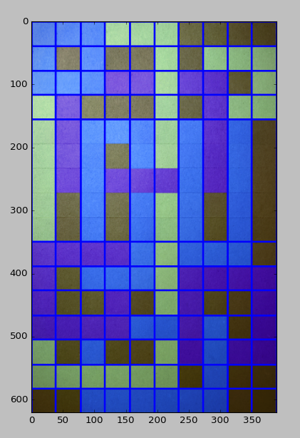
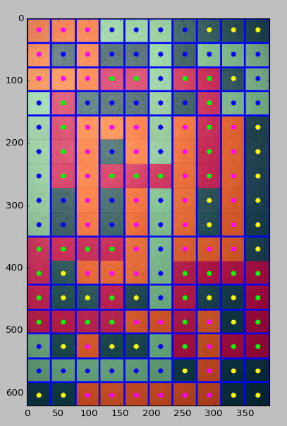

# Kami Solver

This tool aims to automatically solve puzzles from the game [Kami](http://www.stateofplaygames.com/work/kami/).

## Process

- [x] Detect rectangles

    

- [x] Figure out grid pattern
    - From above image, find median distance, use that.
- [x] Pick out a colour from inside of each square

    

- [ ] Accurately cluster those
- [ ] Build neighbour graph
- [ ] Solve graph (bruteforce)

